# Hotel Guest Service Training System

A comprehensive AI-powered training system designed to help hotel front desk staff improve their guest service skills through realistic simulations and intelligent coaching.

## Overview

This system uses three specialized AI agents to create an immersive training environment:

- **🎭 Guest Agent**: Simulates realistic hotel guest scenarios and interactions
- **💡 Coach Agent**: Provides real-time feedback based on training materials using a YAML-backed retriever
- **📊 Report Agent**: Generates detailed training reports and performance analytics

The system processes your existing training documents (PDF, Word, Excel, Text files) and uses them as the knowledge base for coaching and feedback, ensuring consistency with your established training standards.

## System Architecture

The following diagram illustrates the agent-to-agent data flow and system architecture:

```mermaid
flowchart TD
    %% --- STYLING DEFINITIONS (Professional Palette) ---
    %% Agents = Teal (Modern Tech)
    classDef agent fill:#008080,stroke:#333,stroke-width:2px,color:white;
    %% Human = Slate Grey (Neutral/Professional)
    classDef human fill:#506275,stroke:#333,stroke-width:2px,color:white;
    %% Data/Knowledge = Gold (Value/Asset)
    classDef knowledge fill:#FFD700,stroke:#333,stroke-width:1px,color:black;
    %% Output/Success = Green (Result)
    classDef result fill:#2E8B57,stroke:#333,stroke-width:2px,color:white;
    %% System Steps = White/Simple
    classDef system fill:#fff,stroke:#333,stroke-width:1px;
    %% Invisible spacers for better layout
    classDef invisible fill:transparent,stroke:transparent;

    %% --- TOP LEVEL DATA ASSET ---
    YAML[("📚 YAML Training\n\nManual")]:::knowledge

    %% Invisible spacer for vertical separation
    spacer1[ ]:::invisible
    YAML --- spacer1

    %% --- PHASE 1: SETUP ---
    subgraph P1 ["🚀 PHASE 1: SYSTEM SETUP"]
        direction TB
        Start([User Clicks\n\nStart Training]):::human
        Load[Load Training\n\nContext]:::system
        Start --> Load
    end

    %% --- PHASE 2: INTERACTIVE LOOP ---
    subgraph P2 ["💬 PHASE 2: STREAMLIT ENVIRONMENT"]
        direction TB

        %% Nested subgraph for better organization
        subgraph Agents ["Interactive Training Agents"]
            Guest("😟 Guest Agent\n\n(Simulates Customer Scenarios)"):::agent
            Trainee("👨‍🎓 Human Trainee\n\n(Front Desk Staff)"):::human
            Coach("💡 Coach Agent\n\n(Real-time Feedback)"):::agent
        end

        %% The Conversation Flow with better spacing
        Guest <-->|Roleplay\nConversation| Trainee
        Trainee -->|Response for\nEvaluation| Coach
        Coach -.->|Live Coaching\nFeedback| Trainee
    end

    %% --- PHASE 3: REPORTING ---
    subgraph P3 ["📊 PHASE 3: ANALYSIS & REPORTING"]
        direction TB
        End([User Ends\n\nSession]):::human
        History[("📝 Complete Conversation\n\nHistory")]:::knowledge
        ReportAg("📊 Report Agent\n\n(Performance Analyzer)"):::agent
        FinalDoc[/"✅ Comprehensive\nPerformance Report"/]:::result

        %% Internal phase flow
        End --> History
        History --> ReportAg
        ReportAg --> FinalDoc
    end

    %% --- MAIN SYSTEM FLOW ---
    spacer1 --> P1
    P1 --> P2
    P2 --> P3

    %% --- KNOWLEDGE INTEGRATION LINES ---
    YAML -.->|Training Policies &\nBest Practice Guidelines| Coach
    YAML -.->|Evaluation Standards &\nPerformance Metrics| ReportAg
```



### Architecture Overview

**Phase 1 - System Setup**: The training session begins when a user starts the system. The YAML training manual is loaded into memory and made available to the coaching and reporting agents.

**Phase 2 - Interactive Loop**: This is the core training environment where:
- The **Guest Agent** creates realistic customer service scenarios
- The **Human Trainee** practices responses in real-time
- The **Coach Agent** provides immediate feedback based on training standards
- All interactions occur within the Streamlit web interface for seamless user experience

**Phase 3 - Analysis & Reporting**: After the session ends:
- The complete conversation history is analyzed
- The **Report Agent** evaluates performance against training criteria
- A comprehensive report is generated for review and improvement planning

**Knowledge Integration**: The YAML training manual serves as the single source of truth, ensuring all AI agents provide feedback and evaluation based on consistent organizational standards.

## Features

### Core Functionality
- **Real-time Chat Interface**: Streamlit-based web interface for natural conversation flow
- **Intelligent Document Processing**: Automatically processes training materials for reference and retrieval
- **Reference-driven Coaching**: Provides feedback based on your canonical training reference (YAML) and other documents
- **Performance Analytics**: Detailed session reports and progress tracking
- **Multi-format Support**: Handles .pdf, .docx, .doc, .xlsx, .xls, and .txt files
- **Gap Identification**: Identifies areas where training materials may need enhancement

### Training Features
- **Scenario Variety**: Multiple guest service scenarios (billing disputes, room issues, complaints, etc.)
- **Adaptive Difficulty**: Scenarios adjust based on agent performance
- **Real-time Feedback**: Coaching appears in sidebar during conversations
- **Session Management**: Persistent sessions with full conversation history
- **Training Reports**: Comprehensive reports for trainees and managers

## Project Structure

```
hotel-training-system/
├── app.py                          # Main Streamlit application
├── agents/                         # AI agents module
│   ├── __init__.py
│   ├── base_agent.py              # Base class for all agents
│   ├── guest_agent.py             # Guest simulation agent
│   ├── coach_agent.py             # Real-time coaching agent
│   └── report_agent.py            # Report generation agent
├── rag_system/                     # Retriever implementation (YAML-backed)
│   ├── __init__.py
│   └── retriever.py               # Main retriever interface (uses `hotel_training_reference.yaml`)
├── document_processor/             # Document processing pipeline
│   ├── __init__.py
│   ├── processor.py               # Main document processor
│   ├── chunker.py                 # Text chunking strategies
│   └── readers.py                 # Multi-format document readers
├── config/                        # Configuration management
│   ├── __init__.py
│   └── settings.py                # Application settings
├── utils/                         # Utility functions
│   ├── __init__.py
│   ├── logger.py                  # Logging configuration
│   └── session_manager.py         # Session management
├── data/                          # Data storage
│   ├── sessions/                  # Session data
├── logs/                          # Application logs
├── requirements.txt               # Python dependencies
├── .env                          # Environment configuration
├── .env.template                 # Environment template
└── README.md                     # This file
```

## Installation

### Prerequisites
- Python 3.8 or higher
- Access to an LLM API (OpenAI, Anthropic, or enterprise endpoint)
- Training documents in supported formats

### Step 1: Clone and Setup

```bash
# Navigate to the project directory
cd /path/to/hotel-training-system

# Create virtual environment (recommended)
python -m venv venv
source venv/bin/activate  # On Windows: venv\Scripts\activate

# Install dependencies
pip install -r requirements.txt
```

### Step 2: Configure Environment

```bash
# Copy environment template
cp .env.template .env

# Edit .env with your configuration
nano .env  # or use your preferred editor
```

Required configuration:
```env
# Your LLM API configuration
LLM_API_URL=https://api.ai.it.cornell.edu
LLM_API_KEY=your_api_key_here

# Model configuration (adjust based on available models)
FAST_MODEL=gpt-3.5-turbo
BALANCED_MODEL=gpt-4
SMART_MODEL=gpt-4
DEFAULT_MODEL=gpt-4

# Embedding configuration
EMBEDDING_MODEL=text-embedding-ada-002
EMBEDDING_API_URL=https://api.ai.it.cornell.edu
```

## Usage

### Starting the Application

```bash
# Make sure you're in the project directory
cd /path/to/hotel-training-system

# Activate virtual environment
source venv/bin/activate  # On Windows: venv\Scripts\activate

# Run the Streamlit application
streamlit run app.py
```

The application will be available at `http://localhost:8501`

### Training Workflow

1. **Start Training Session**
   - Click "Start Training Session" in the sidebar
   - The system will load training documents and initialize AI agents
   - A guest scenario will be automatically generated

2. **Interact with Guest**
   - Respond to the simulated guest as you would at the front desk
   - Use professional, empathetic language
   - Focus on problem-solving and service recovery

3. **Receive Real-time Coaching**
   - Coaching feedback appears in the sidebar after each response
   - Feedback is based on your training materials
   - Suggestions include specific improvements and best practices

4. **Complete Session**
   - Click "End Training Session" when finished
   - Review the comprehensive session report
   - Use insights for continued learning and development

### Advanced Features

#### Document Management
The system uses a canonical YAML reference (`hotel_training_reference.yaml`) as the primary knowledge source for coaching and reporting. The retriever loads that YAML at startup and flattens it into searchable sections. If you update the YAML or add new in-memory documents, you can reload the retriever:

```python
from rag_system.retriever import RAGRetriever
from config.settings import AppConfig

config = AppConfig()
rag = RAGRetriever(config)
rag.refresh_vector_store()  # reloads YAML sections from disk
```

#### Custom Scenarios
You can influence scenario generation by adding specific scenario documents to your training materials folder.

#### Performance Analytics
Session reports include:
- Performance metrics (1-5 scale ratings)
- Specific examples from the conversation
- Training recommendations
- Identified knowledge gaps

## Configuration Options

### Model Configuration
Optimize costs by using different models for different agents:

```env
# Fast model for quick guest responses
FAST_MODEL=gpt-3.5-turbo

# Balanced model for guest interactions
BALANCED_MODEL=gpt-4

# Smart model for coaching and reports
SMART_MODEL=gpt-4
```

### Retrieval Configuration
Adjust retrieval settings (used to control how many YAML sections the retriever returns):

```env
# Number of sections to retrieve for context
RAG_TOP_K=5

# Text chunking parameters (used by document processor)
CHUNK_SIZE=1000
CHUNK_OVERLAP=200
```

### Application Settings
```env
# Debug mode (detailed logging)
DEBUG=true

# Session timeout (minutes)
SESSION_TIMEOUT_MINUTES=60

# Maximum messages per session
MAX_MESSAGE_HISTORY=50
```

## Troubleshooting

### Common Issues

**No training documents found:**
- Check the `TRAINING_DOCS_PATH` in `config/settings.py`
- Ensure documents are in supported formats
- Check file permissions

**API connection errors:**
- Verify `LLM_API_URL` and `LLM_API_KEY` in `.env`
- Test API connectivity independently
- Check network firewall settings

**Slow performance:**
- Use faster models for guest agent (`FAST_MODEL=gpt-3.5-turbo`)
- Reduce `RAG_TOP_K` for fewer document retrievals
- Optimize `CHUNK_SIZE` for your documents

**Memory issues:**
- Reduce `MAX_MESSAGE_HISTORY`
- Use smaller `CHUNK_SIZE`
- Clear vector store and reinitialize: `rag.refresh_vector_store()`

### Logging

Logs are stored in the `logs/` directory:
- `hotel_training_YYYYMMDD.log`: General application logs
- `hotel_training_errors_YYYYMMDD.log`: Error-specific logs

Increase logging detail:
```env
LOG_LEVEL=DEBUG
```

### Document Processing Issues

**Large file errors:**
```env
# Increase maximum file size (MB)
MAX_DOCUMENT_SIZE_MB=20
```

**Encoding problems:**
The system tries multiple encodings automatically. For persistent issues, convert files to UTF-8.

**Unsupported formats:**
Add format support in `document_processor/readers.py` or convert files to supported formats.

## Development

### Adding New Features

1. **New Agent Types**: Extend `BaseAgent` class in `agents/`
2. **Document Formats**: Add readers in `document_processor/readers.py`
3. **Chunking Strategies**: Implement in `document_processor/chunker.py`
4. **Vector Stores (optional)**: Add a vector store implementation under `rag_system/` if you later want to re-enable embedding-based retrieval

### Testing

```bash
# Run basic functionality test
python -c "from config.settings import AppConfig; print('Configuration loaded successfully')"

# Test document processing
python -c "from document_processor.processor import DocumentProcessor; print('Document processor ready')"

# Test RAG system
python -c "from rag_system.retriever import RAGRetriever; print('RAG system ready')"
```

### Performance Optimization

- **Caching**: Implement response caching for repeated queries
- **Batch Processing**: Process multiple documents simultaneously
- **Model Selection**: Use appropriate model sizes for different tasks
-- **Vector Store Optimization (optional)**: If you integrate a vector store, tune its settings for your data size

## Security Considerations

- Store API keys securely (never commit `.env` files)
- Implement rate limiting for production deployment
- Use HTTPS for production deployments
- Regularly update dependencies for security patches
- Consider data privacy regulations for training session storage

## Support and Contributing

### Getting Help
- Check the troubleshooting section above
- Review logs in `logs/` directory
- Ensure all dependencies are installed correctly

### Contributing
1. Fork the repository
2. Create feature branches
3. Follow existing code style
4. Add tests for new functionality
5. Submit pull requests with clear descriptions

## License

This project is developed for educational purposes as part of INFO 5940 - Fall 2025.

## Acknowledgments

- Built with Streamlit for the web interface
Uses a YAML-backed reference for retrieval; vector stores are optional for advanced setups
- Integrates with various LLM providers
- Supports multiple document formats through specialized libraries

---

For questions or support, please refer to the troubleshooting section or check the application logs for detailed error information.